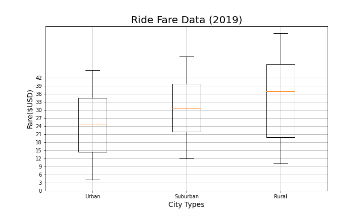
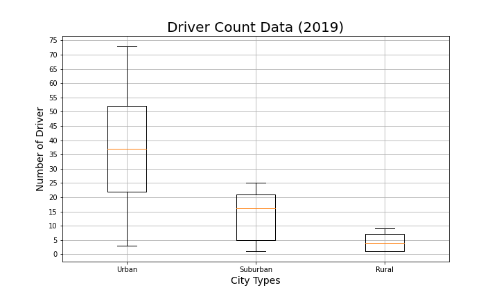
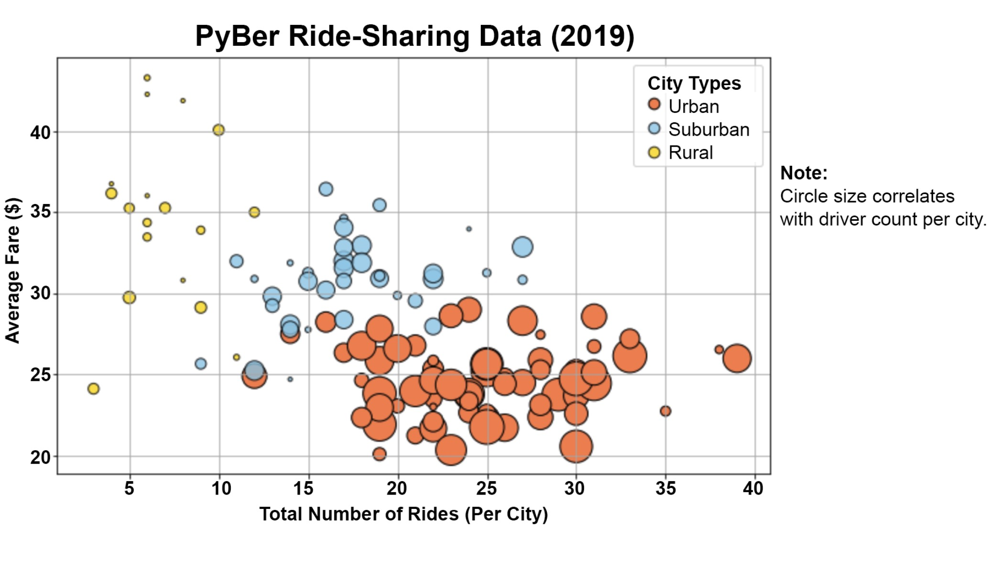
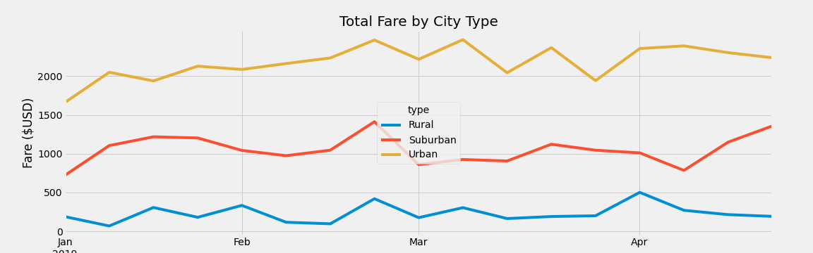

# PyBer_Analysis

# Overview of the analysis
This challenge displays the ride-sharing differ by city type and how those differences can be used by decision-makers at PyBer. 

## The purpose of the new analysis
During this challenge, I created a summary DataFrame of the ride-sharing data by city type Using using Python skills and knowledge of Pandas. With many different types of graph including plots, bar chart, and pie chart, the analysis provides the differece came from. Then, using Pandas and Matplotlib, I created a multiple-line graph that shows the total weekly fares for each city type which is more clear and visuable for people who want to understand the summary results.

# Results: There is a description of the differences in ride-sharing data among the different city types. Ride-sharing data include the total rides, total drivers, total fares, average fare per ride and driver, and total fare by city type
- Fares differ from various type of cities
  - Fares tend to be higher in the rural cities compared to the urban cities and fares in suburban cities is between rural and urban.
  - The mean of fare in rural is around $36 while the mean fare in urban is approximately $24.

  - The total number of rides is the least in rural cities and the most in urban cities.
  - the mean of rides in urban are around 37 but the mean of rural rides are 4. This is a dramatical difference.

conclusion: 
 - Less rides resultes to higher fares.
 - There are less population in rural cities and the distance of rural might be longer than urban cities. Thus, there are less rides in rural cities.
  

# Summary
## here is a statement summarizing three business recommendations to the CEO for addressing any disparities among the city types

